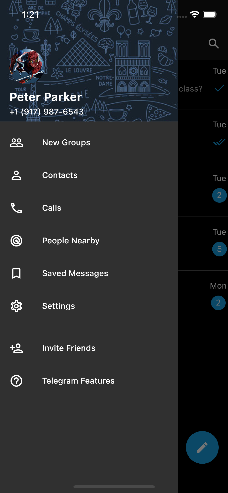
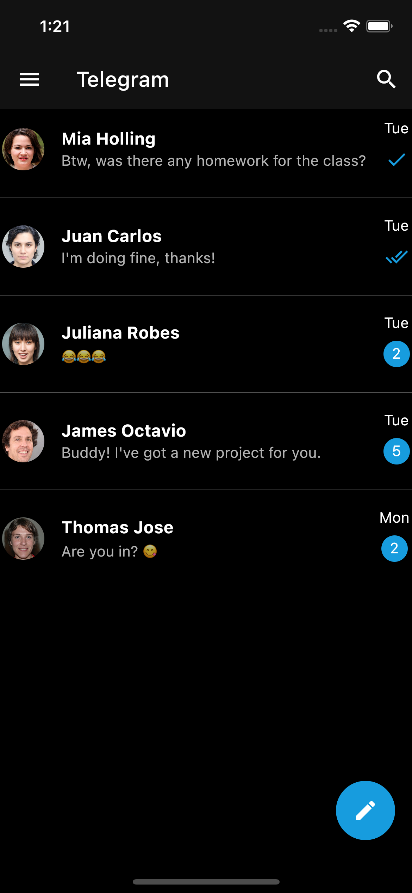
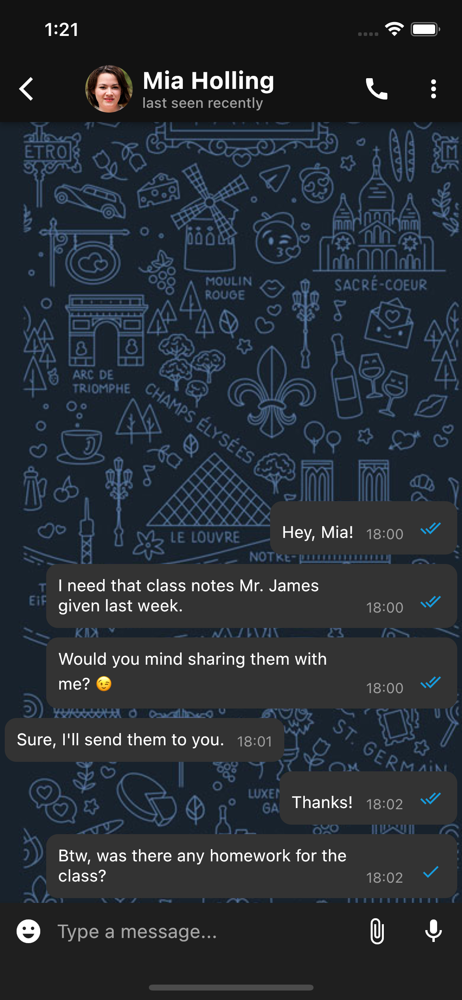

# Telegram Chat UI with Flutter 💙

Just tried to build the Telegram chat UI with Flutter. This is just a demo. Attaching the screenshots below.

    &nbsp;&nbsp;&nbsp;&nbsp;

    &nbsp;&nbsp;&nbsp;&nbsp;

Nothing else, just UI and thats it.

🚀 The release builds are available [here](https://github.com/HeySreelal/TelegramUI/releases/tag/v0.0.1).

# Thank you 💙